# AssistMe

This repository contains the code for the Android application: **AssistMe**.

This app assists users in performing various trivial tasks via an Android application. It can act as a personal diary, an attendance manager, a speech-text translator and perform many other functions as briefly discussed below.

Some of the features of the app are listed as follows:-
* Attendance Manager
* Speech-Text Translator
* Text-Speech Converter
* Notes Keeper
* Quote Generator
* Brain Trainer
* Disco Lights

Here are a few screenshots of the working application:-

* The **Home** page displays the various utilities that the user can choose from.

 
  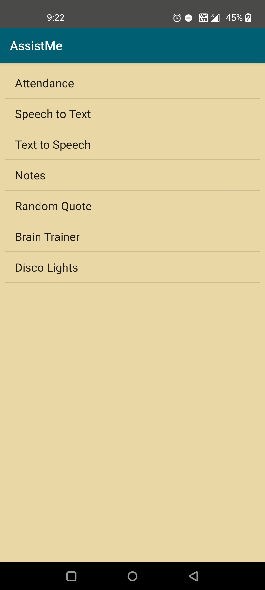

* The **Attendance** option can be used to manage and monitor the attendance in different subjects.

  * Users can display all subjects as a list, add a new one, manage each subject or delete them from the storage.
  
 
    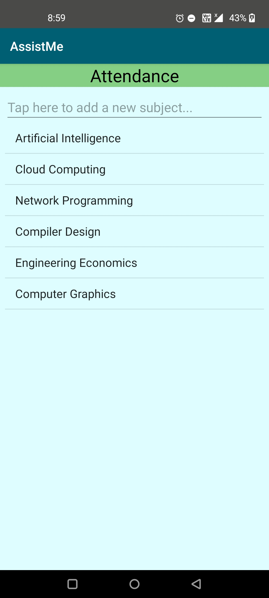
    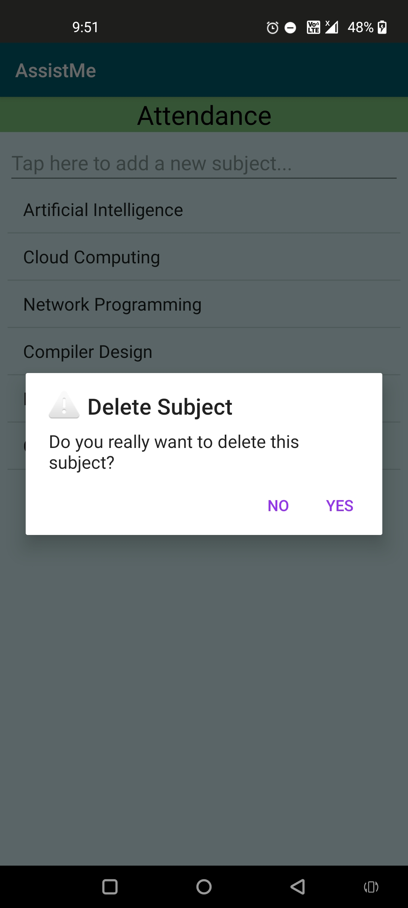
  

  
  * Users can input the number of days for which they were present and absent in each subject and the minimum attendance required in order to manage and monitor the       attendance of any subject. They can also edit any of this data and even the subject name at any time and save them permanently. 
  
 
    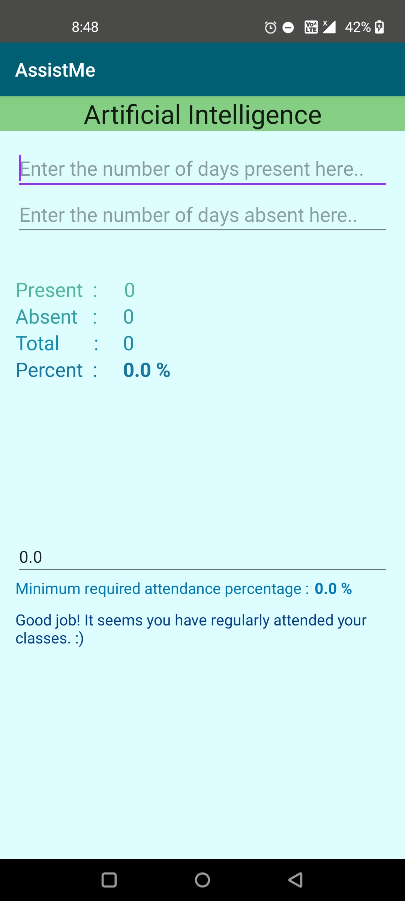
    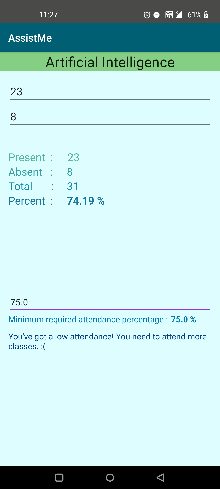
  

* The **Speech To Text** allows users to translate their speech into text and also save the same text in the form of a note in the app.

 
    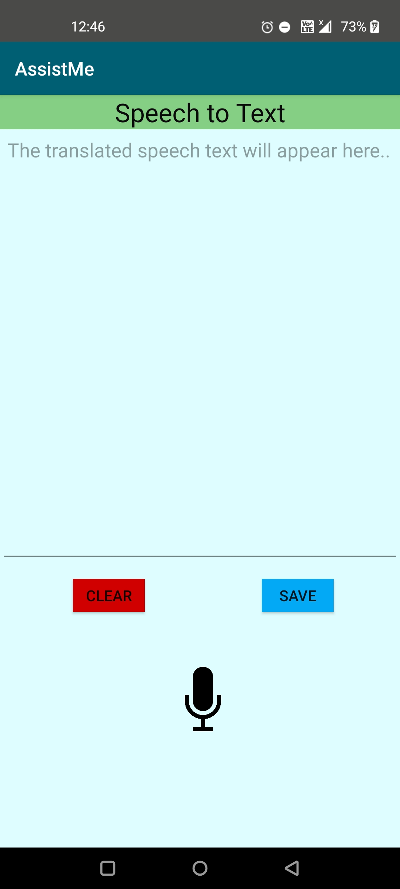
    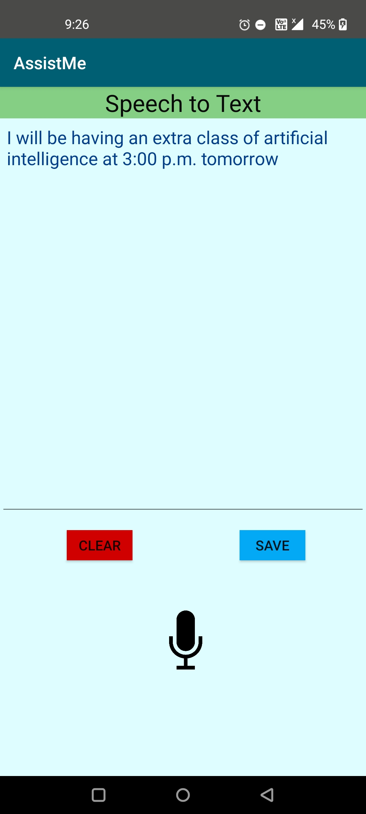

* The **Text To Speech** lets users to convert their text into speech in a chosen language and voice and with a set speed and pitch from the screen. This text can also be saved as a note in the app.

 
    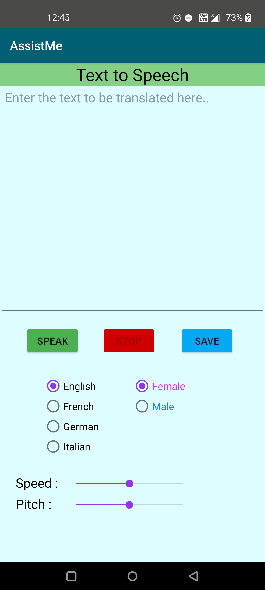
    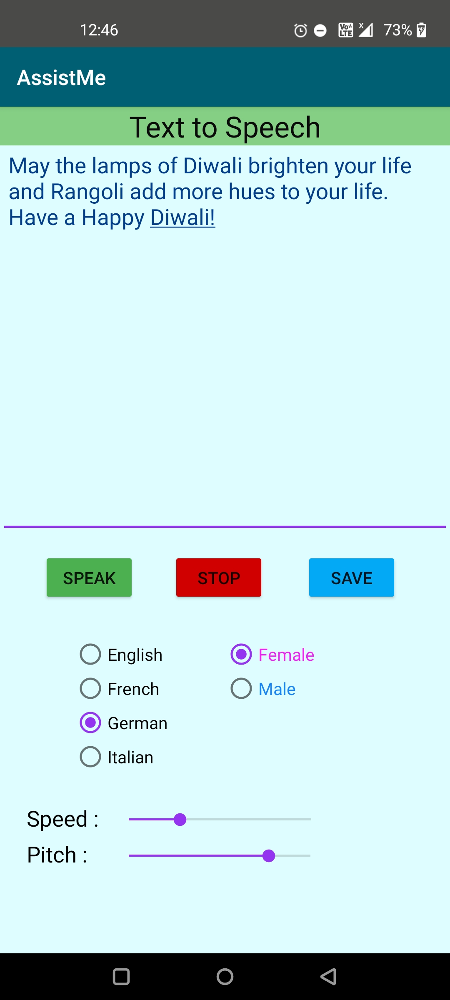

* The **Notes** option helps in managing and sharing notes with a title and a description.

  * Users can display all notes, add a new note and delete one or all of them from the memory.
  
 
    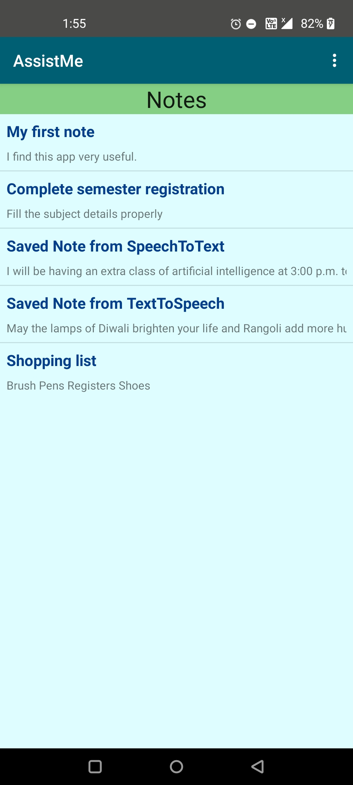
    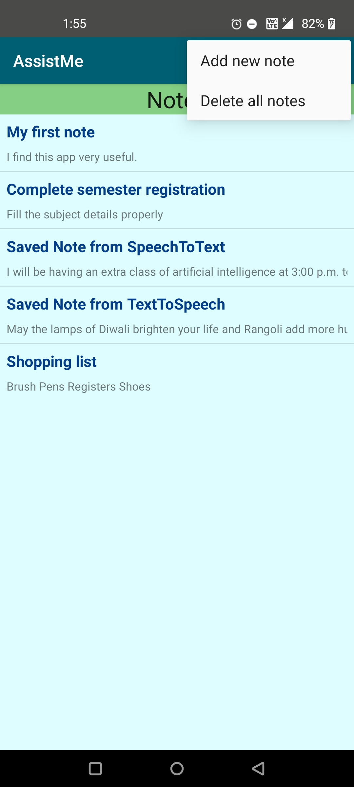
  

 
  * Users can edit each note, set calendar reminders and share the note as text via different apps on the device.
  
 
    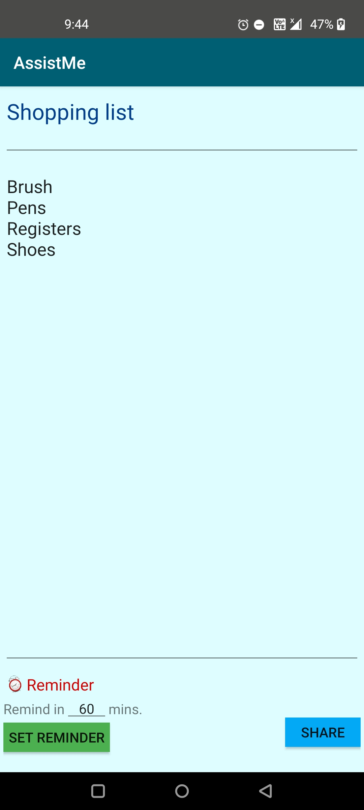
    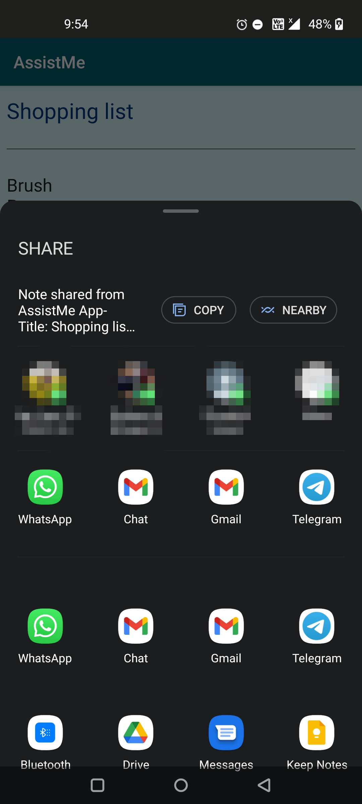
 

* The **Random Quote** displays a quote and its author on the screen by fetching this information using a random quote generatr API.

 
  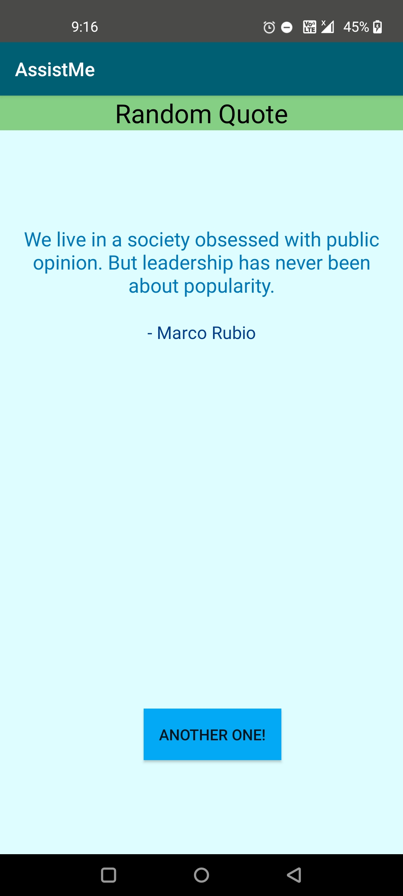

  
* The **Brain Trainer** is a time-bound trivia game to train and test the Mathematical skills with questions based on +, -, *, / and % operators.

 
  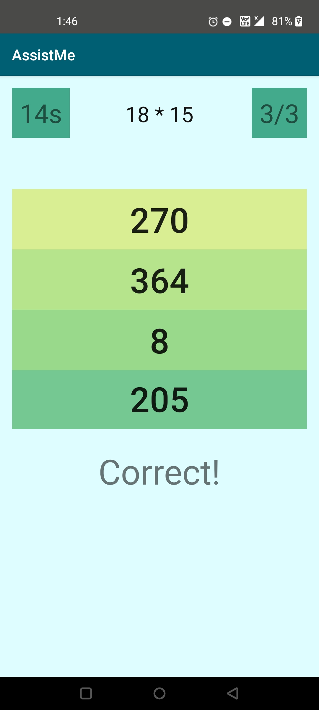
  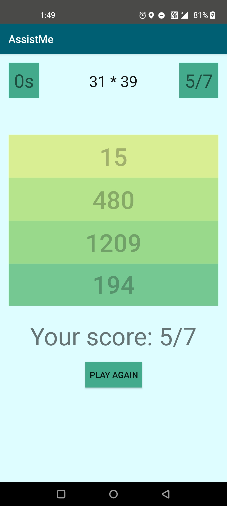

* The **Disco Lights** option fills the screen with different colors which keep changing randomly.

 
  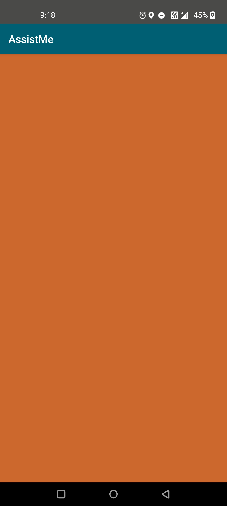
  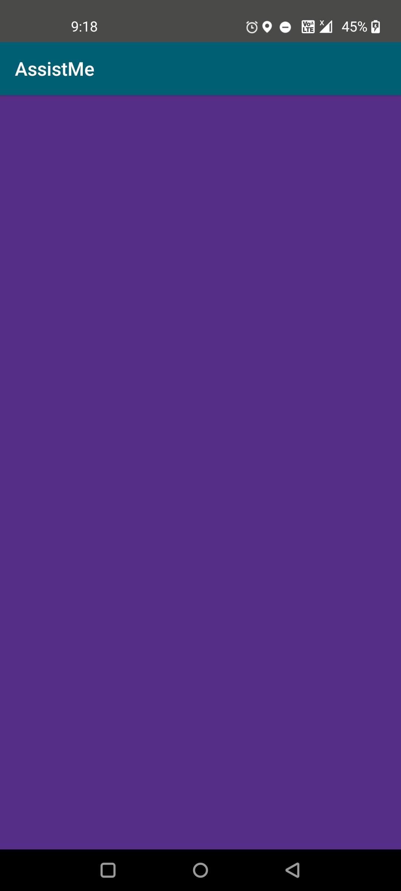

